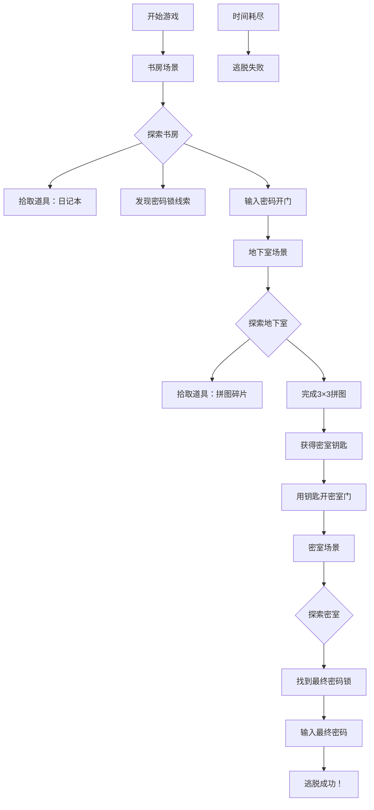

## 1. 产品概述

在线密室逃脱解谜游戏——玩家被困在神秘建筑中，需要通过探索场景、收集道具、解开谜题来逃出密室。游戏支持多房间场景切换、道具拖拽使用、数字密码锁与拼图谜题、30分钟倒计时以及逐步提示系统。

- 目标用户：喜欢解谜/逃脱类游戏的休闲玩家
- 核心价值：沉浸式密室体验 + 策略性解谜乐趣

## 2. 核心功能

### 2.1 用户角色

无角色区分，单玩家模式。

### 2.2 功能模块

1. **游戏主界面**：场景展示、道具栏、计时器、提示按钮
2. **房间场景**：书房、地下室、密室（3个场景）
3. **谜题系统**：数字密码锁、3×3拼图
4. **道具系统**：拾取、拖拽、组合使用
5. **计时器系统**：30分钟倒计时、暂停/继续
6. **提示系统**：逐步文字线索、每谜题最多3次

### 2.3 页面详情

| 页面名称 | 模块名称 | 功能描述 |
|---------|---------|---------|
| 游戏主界面 | 场景展示区 | 展示当前房间场景（书房/地下室/密室），包含可交互热点（门、物品、密码锁等） |
| 游戏主界面 | 道具栏 | 底部固定显示已获得道具，支持拖拽使用和道具组合 |
| 游戏主界面 | 计时器 | 顶部显示剩余时间，倒计时30分钟，时间归零提示失败 |
| 游戏主界面 | 提示面板 | 点击提示按钮展开提示面板，逐步显示文字线索 |
| 游戏主界面 | 密码锁弹窗 | 点击密码锁热点弹出数字输入面板，输入正确密码解锁 |
| 游戏主界面 | 拼图弹窗 | 点击拼图热点弹出3×3拼图面板，完成拼图获得钥匙 |
| 开始页面 | 游戏入口 | 游戏标题、开始按钮、简要说明 |
| 结束页面 | 结果展示 | 显示胜利/失败、用时、可重新开始 |

## 3. 核心流程

玩家从书房开始，探索场景中的可交互物品获取道具和线索。书房中找到的线索指向地下室密码，解锁通往地下室的门。在地下室中发现拼图碎片，完成拼图获得密室钥匙。用钥匙打开密室门，进入密室后找到最终密码锁，输入正确密码成功逃脱。

## 4. 用户界面设计

### 4.1 设计风格

- **主色调**：暗色系（深灰 #1a1a2e、深蓝 #16213e）营造密室神秘氛围
- **强调色**：琥珀金 #e2b714（关键交互元素）、血红 #c0392b（危险/计时器）
- **按钮风格**：略带3D效果的圆角按钮，暗色底+金色边框
- **字体**：标题使用衬线字体（思源宋体/Cinzel），正文使用无衬线（Source Han Sans/Noto Sans）
- **布局风格**：全屏沉浸式场景+底部道具栏+顶部状态栏
- **图标风格**：线性图标，金色描边，暗色背景

### 4.2 页面设计概览

| 页面名称 | 模块名称 | UI元素 |
|---------|---------|--------|
| 开始页面 | 英雄区 | 暗色渐变背景、标题大字、粒子效果、开始按钮 |
| 游戏主界面 | 场景区 | 全屏场景图、可交互热点发光标记、鼠标悬停高亮 |
| 游戏主界面 | 道具栏 | 底部半透明深色条、道具图标网格、拖拽时的发光效果 |
| 游戏主界面 | 计时器 | 顶部右侧、数字时钟样式、低于5分钟变红闪烁 |
| 游戏主界面 | 提示面板 | 右侧滑出面板、半透明背景、分步骤显示线索 |
| 游戏主界面 | 密码锁弹窗 | 居中弹窗、复古密码锁造型、数字拨盘输入 |
| 游戏主界面 | 拼图弹窗 | 居中弹窗、3×3网格、碎片可拖拽移动 |
| 结束页面 | 结果区 | 大字标题、用时统计、重新开始按钮 |

### 4.3 响应式设计

- 桌面端优先设计，适配 1280px+ 宽度
- 移动端适配：场景缩放、触摸拖拽替代鼠标拖拽
- 触摸优化：增大热点点击区域、道具栏适配手指操作

### 4.4 3D场景指导

本项目不涉及3D场景，采用2D插画风格场景图 + CSS动画营造氛围。
