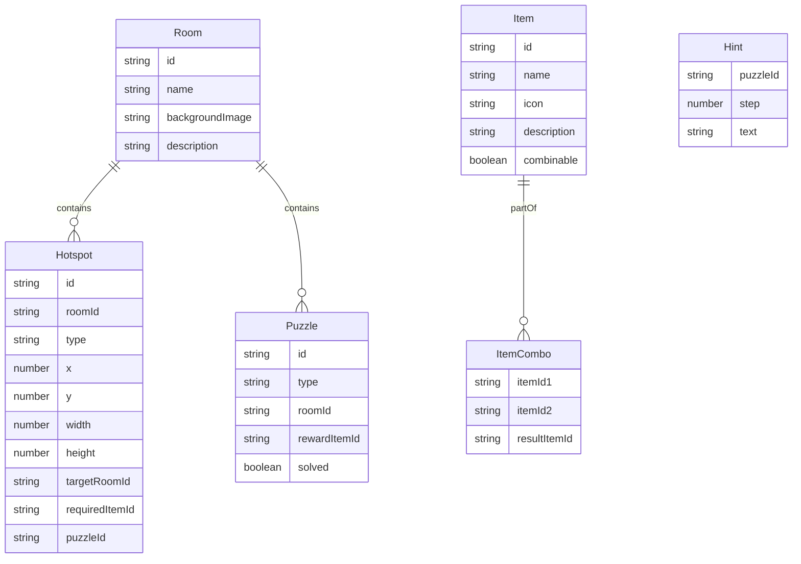

## 1. 架构设计

```mermaid
flowchart TD
    subgraph "前端层"
        A["Vue 3 组件层"] --> B["Pinia 状态管理"]
        A --> C["Composables 逻辑层"]
        B --> D["游戏状态 Store"]
        B --> E["道具状态 Store"]
        B --> F["计时器 Store"]
    end

    subgraph "交互层"
        G["HTML5 Drag-and-Drop"] --> A
        H["CSS Grid + 拖拽"] --> A
    end

    subgraph "数据层"
        I["静态 JSON 谜题数据"] --> B
        J["场景配置数据"] --> B
        K["提示文本数据"] --> B
    end

    subgraph "样式层"
        L["TailwindCSS"] --> A
        M["CSS 动画"] --> A
    end
end
```

## 2. 技术说明

- **前端框架**：Vue 3 + Composition API + TypeScript
- **初始化工具**：vite-init (vue-ts 模板)
- **状态管理**：Pinia（管理游戏状态、道具、场景切换、计时器）
- **拖拽交互**：HTML5 Drag-and-Drop API（道具拖拽使用）
- **拼图实现**：CSS Grid + 拖拽事件（3×3拼图）
- **计时器**：setInterval 封装为 Composable hook（useTimer）
- **提示系统**：静态 JSON 数据 + Pinia Store 控制显示
- **样式**：TailwindCSS（暗色主题 + 自定义配色）
- **后端**：无（纯前端游戏）

## 3. 路由定义

| 路由 | 用途 |
|------|------|
| / | 游戏开始页面 |
| /game | 游戏主界面（场景+道具栏+计时器+提示） |
| /result | 游戏结束页面（胜利/失败） |

## 4. API 定义

本项目为纯前端应用，无后端 API。所有数据通过静态 JSON 配置。

## 5. 数据模型

### 5.1 数据模型定义



### 5.2 场景配置数据

**书房（study）**
- 热点：书架（可点击获取日记本）、密码锁门（输入密码4位打开）、桌子（可点击获取线索纸）
- 谜题：数字密码锁（密码：1947，线索来自日记本和线索纸）

**地下室（basement）**
- 热点：拼图桌（点击打开拼图游戏）、密室门（需要钥匙开启）、工具箱（获取螺丝刀）
- 谜题：3×3拼图（完成后获得密室钥匙）

**密室（secret-room）**
- 热点：最终密码锁（需要输入最终密码）、保险箱（用螺丝刀打开获得最终密码线索）
- 谜题：最终数字密码锁（密码：8264，线索来自保险箱内文件）

## 6. 项目目录结构

```
src/
├── components/
│   ├── GameScene.vue          # 场景渲染组件
│   ├── Hotspot.vue            # 可交互热点组件
│   ├── ItemBar.vue            # 道具栏组件
│   ├── ItemSlot.vue           # 道具格子组件
│   ├── PasswordLock.vue       # 数字密码锁弹窗
│   ├── PuzzleGame.vue         # 3×3拼图弹窗
│   ├── HintPanel.vue          # 提示面板组件
│   ├── TimerDisplay.vue       # 计时器显示组件
│   └── GameOverlay.vue        # 游戏弹窗/遮罩层
├── composables/
│   ├── useTimer.ts            # 计时器 Hook
│   ├── useDragDrop.ts         # 拖拽交互 Hook
│   └── useGameLogic.ts        # 游戏逻辑 Hook
├── stores/
│   ├── gameStore.ts           # 游戏主状态
│   ├── itemStore.ts           # 道具状态
│   └── timerStore.ts          # 计时器状态
├── data/
│   ├── rooms.json             # 房间配置数据
│   ├── puzzles.json           # 谜题配置数据
│   ├── items.json             # 道具配置数据
│   └── hints.json             # 提示文本数据
├── pages/
│   ├── StartPage.vue          # 开始页面
│   ├── GamePage.vue           # 游戏主页面
│   └── ResultPage.vue         # 结果页面
├── types/
│   └── index.ts               # TypeScript 类型定义
├── App.vue
└── main.ts
```
